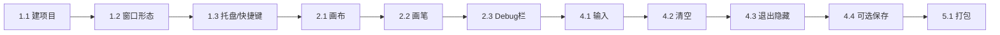

# ScreenScribe（屏上书）实施计划（不含阶段三，React 前端）

## 技术选型与范围

- **壳**：Tauri 2（Rust）
- **前端**：React（create-tauri-app 选 React 模板）
- **本期不做**：阶段三（DXGI 抓屏 + MJPEG HTTP 流）

实施顺序：阶段 1 → 阶段 2 → 阶段 4 → 阶段 5。

---

## 阶段 1：项目与窗口

### 1.1 创建 Tauri 2 + React 项目

- 在 `E:\Projects\ScreenScribe` 下执行（或在其父目录执行后把生成的项目移入）：
  - `npm create tauri-app@latest` 或 `pnpm create tauri-app@latest`
  - 项目名：`screen-scribe` 或 `ScreenScribe`（与 zlh-web-theme 分离）
  - 前端：**React**，包管理器与 TS/JS 按需选择
- 确认能跑起默认窗口：`npm run tauri dev`（或对应命令）。

生成结构大致为：

- `src/` — React 前端
- `src-tauri/` — Rust 后端、`tauri.conf.json`、capabilities

### 1.2 窗口配置：无边框、全屏、置顶、透明

在 `src-tauri/tauri.conf.json` 的 `app.windows` 中配置主窗口（或唯一窗口）：

- `decorations: false` — 无边框
- `fullscreen: true` — 全屏铺满当前显示器
- `alwaysOnTop: true` — 始终置顶
- `transparent: true` — 背景透明，便于做画布覆盖层

若 Tauri 2 要求窗口宽高，可设与主屏一致或使用 `fullscreen: true` 为主。Windows 下透明 + 无边框一般无需额外 feature；若文档要求可再补。

**注意**：全屏后 ESC 可能无法退出，需依赖阶段 4 的快捷键/托盘退出。

### 1.3（可选）托盘或快捷键

- **托盘**：在 `Cargo.toml` 中为 tauri 启用 `tray-icon`，在 Rust 的 `setup` 或前端用 `@tauri-apps/api/tray` 创建 TrayIcon，菜单项：退出、隐藏/显示窗口。
- **快捷键**：可用 Tauri 的 global shortcut 或前端 keydown 监听（如 Ctrl+Shift+Q 退出、Ctrl+Shift+H 隐藏），调用 `@tauri-apps/api/window` 的 `appWindow.close()` 或 `hide()`。

二选一或都做，避免长期挡屏无法退出。

---

## 阶段 2：画布与画笔

### 2.1 全屏画布与层级

- 前端根容器全屏（`width: 100vw`, `height: 100vh`），内部分层：
  - **画布层**：`<canvas>` 铺满视口（width/height 设为窗口尺寸，用 CSS 铺满），用于画笔。
  - **Debug 栏**：见 2.3，置于最上层。
- 后续若做阶段三，可在画布下层增加「屏幕流」`` 层；当前仅画布 + Debug 即可。
- 使用 React state 保存窗口/画布尺寸，在 resize 或 Tauri 的 size 事件中更新，并同步到 canvas 的 width/height 与 CSS，避免拉伸模糊。

### 2.2 画笔逻辑

- 在 canvas 上监听 `pointerdown`、`pointermove`、`pointerup`（及 `pointercancel`）。
- `pointerdown`：记录起点，开始新路径（beginPath）。
- `pointermove`：若处于「按下」状态，则 `lineTo` 当前点并 `stroke`，颜色/线宽可先写死（如黑色、2px）。
- `pointerup`/`pointercancel`：结束当前笔画。
- 为保持坐标与设备像素一致，可根据 `window.devicePixelRatio` 缩放 canvas 的 context 或设置 canvas 的 width/height 为「逻辑尺寸 × devicePixelRatio」，再通过 CSS 保持视口大小。

### 2.3 Debug 栏

- 右上角：`position: fixed; top: 0; right: 0`，半透明背景、小字号，z-index 高于画布。
- 显示内容示例：指针坐标 (clientX, clientY)、pressure（若存在）、画布/窗口宽高、当前笔画状态（idle/drawing）、FPS（可选，requestAnimationFrame 计数）。
- 用 React state 更新；可设快捷键（如 Ctrl+Shift+D）切换显示/隐藏。

---

## 阶段 4：输入与基础功能

### 4.1 输入

- 默认「始终捕获」：所有 pointer 事件由画布接收，不配置鼠标穿透；若日后要做「不画时穿透」，再在 Rust 侧改窗口属性并加切换逻辑。

### 4.2 清空画布

- 前端：一键（如按钮或快捷键）清空 canvas：`ctx.clearRect(0, 0, width, height)`。

### 4.3 退出/隐藏

- 快捷键或托盘菜单：调用 Tauri API 关闭或隐藏窗口（见 1.3）。

### 4.4（可选）保存

- 前端：`canvas.toBlob('image/png')` 得到 Blob。
- 通过 Tauri 的「保存文件」能力：用 `@tauri-apps/plugin-dialog` 的保存对话框选路径，再用 `@tauri-apps/plugin-fs` 写入文件；或通过 Tauri Command 把 Blob 转为 bytes 后由 Rust 写文件。需在 `src-tauri/capabilities` 中为 dialog 与 fs 开放相应 scope。

---

## 阶段 5：打包与分发

- 在项目根目录执行：`cargo tauri build`（或 `npm run tauri build`），生成 Windows 安装包/便携 exe。
- 在 README 或文档中说明：目标环境需已安装 **WebView2**（Windows 11 通常自带；Windows 10 需确认或提供链接）。

---

## 顺序小结（本期）

- **阶段 1**：建项目 → 窗口（透明全屏置顶）→ 可选托盘/快捷键。
- **阶段 2**：全屏画布 → 画笔画线 → 右上角 Debug 栏。
- **阶段 4**：默认捕获 → 清空 → 退出/隐藏 → 可选保存。
- **阶段 5**：打包与 WebView2 说明。

按上述顺序实现即可得到「全屏透明画布 + 画笔 + Debug 栏」的 ScreenScribe 初版；阶段三（MJPEG 屏幕流）留待后续按同一文档的 3.1–3.6 实施。
